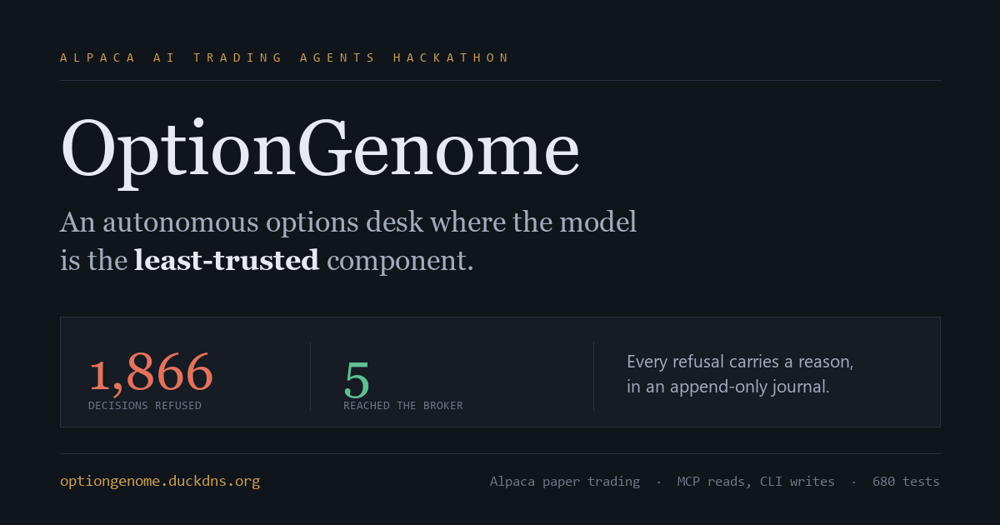

<div align="center">

# OptionGenome

**An autonomous options trading desk where the AI is the least-trusted component.**

Built for the Alpaca AI Trading Agents Hackathon · Paper trading only

[**Live dashboard**](https://optiongenome.duckdns.org) ·
[**Slide deck**](https://optiongenome.duckdns.org/deck) ·
[**Write-up**](docs/WRITEUP.md) ·
[**Video script**](docs/VIDEO-SCRIPT.md)



</div>

---

## The problem

Almost every AI trading agent works the same way: give a language model market data, ask it
what to trade, then place the trade.

That design has one flaw, and it is fatal. **A language model always answers.** Ask it for a
trade and you will get a trade, with a confident and plausible rationale attached, whether or
not there is anything worth trading. Models are excellent at generating a position and
terrible at refusing one.

In options selling, refusing is most of the job. The edge is small and the tails are large.
A system that takes a mediocre trade because it was asked a question will lose money slowly
and then quickly.

## The approach

OptionGenome inverts the usual arrangement. **The model never decides anything.**

Deterministic code reads the market, decides whether trading is permitted at all, constructs
every candidate structure, and prices them. The model's entire job is to pick one item from a
list it did not write. A separate deterministic component then re-derives every number on that
pick from raw option symbols and live quotes, checks it against 15 rules, and throws it out if
anything fails.

The model cannot see account equity. It cannot see buying power, the risk budget, or the rules
it is being judged against. It cannot invent a strike, an expiry, a size, or a limit price. It
cannot call a broker tool. Its reply is parsed as hostile input.

> **In the live run so far: 2,417 decisions reached the model. 2,411 were refused. 6 became trades.**

That ratio is the product, not a side effect of it.

---

## How it works

Authority flows in exactly one direction. Nothing downstream can reach back upstream.

```
  ┌───────────┐   ┌───────────┐   ┌ ─ ─ ─ ─ ─ ┐   ┌──────────────┐   ┌────────────┐
  │ MarketDNA │──>│ Roll Desk │──>  the model  ──>│ Risk Officer │──>│ Alpaca CLI │
  └───────────┘   └───────────┘   └ ─ ─ ─ ─ ─ ┘   └──────────────┘   └────────────┘
   what is legal   what to trade   ranks only      may capital move?   mleg/limit/day
    arithmetic      + lifecycle   {pick_id, why}   15 checks, pure     the only writer
     no model      priced, whole  untrusted input  sole capital gate
```

| Stage | Responsibility | Can it move money? |
|---|---|---|
| **MarketDNA** | Classifies the regime from arithmetic alone: EMA 20/50, Wilder's ADX(14), 20-day realized volatility against its 100-day median, IV rank, and a data-driven economic calendar. Emits a *permission set* — which structures are legal now, and how many lots. | No |
| **Roll Desk** | Screens the live SPY chain (~2,000 contracts in the entry window), builds fully specified defined-risk candidates, prices them from live quotes, and manages every open position through its lifecycle each pass. | No |
| **The model** | Qwen-2.5-72B via Featherless. Receives immutable candidate descriptions, returns `{"pick_id", "rationale"}`. Nothing else. | No |
| **Risk Officer** | 15 deterministic checks. Recalculates everything from the OCC legs rather than trusting the ticket. | **Yes, and only it** |
| **Alpaca CLI** | Executes what was allowed. `order_class=mleg`, always limit, always day, never a market order on a spread. | Executes only |

### The gate that matters most

Selling premium only pays when implied volatility exceeds what the underlying goes on to
realize. MarketDNA measures both and **withholds permission entirely** when implied is not at
least 5% above realized, the one condition under which this strategy has no edge to begin
with. No amount of attractive-looking candidates gets past a zeroed lot count.

---

## What the model can and cannot do

This is the security boundary, and it is enforced by tests rather than by prompt instructions.

| | |
|---|---|
| Sees | Candidate id, structure type, strikes, expiry, width, credit, delta, quote freshness |
| **Never sees** | Account equity · buying power · daily risk budget · drawdown · the risk rules · open positions |
| May return | `{"pick_id": "<id from the supplied list>", "rationale": "<one sentence>"}` |
| Cannot | Create or alter a strike, expiry, size, credit or limit · call any broker tool · override a deny |

Its reply is treated as an attack surface: code fences stripped, shape validated, and the
returned `pick_id` verified to belong to the shortlist it was given. **Extra keys are ignored
rather than obeyed.** A response containing `"lots": 500` or `"override_risk_officer": true`
changes nothing. Any malformed reply, unknown id, or timeout falls back to the first legal
candidate and is journalled. 35 adversarial tests cover this path.

---

## The Risk Officer

Fifteen checks. Pure functions: no network, no filesystem, no database, no clock read. The
same inputs always produce the same verdict. **Every check runs** — failures accumulate rather
than short-circuit — so a refusal reports every reason at once. Any exception is a `DENY`.

Its defining property is that **it does not trust the ticket it is handed.** Width, credit,
maximum loss, DTE, structure type and every leg relationship are recalculated from the OCC
symbols and live quotes. A ticket claiming `max_loss: 1.0` on a $400 spread does not get to
buy itself past the cap.

| # | Check | Refuses when |
|---|---|---|
| 1 | `regime_permits` | The regime forbids new entries, or forbids this structure in this regime |
| 2 | `global_allowlist` | Structure is not a put credit spread or iron condor, by derived geometry |
| 3 | `max_loss_pct` | Recalculated max loss exceeds 0.75% of equity |
| 4 | `daily_risk` | Projected risk opened today exceeds 2% of equity |
| 5 | `drawdown` | Drawdown reaches 5% — the desk goes flatten-only |
| 6 | `overlapping_short` | Short exposure overlaps an existing position |
| 7 | `credit_to_width` | Credit/width below 0.15, or the structure is not actually a credit |
| 8 | `short_leg_spread` | The short leg's bid-ask is too wide to trade honestly |
| 9 | `quote_age` | Any quote is 5 seconds old or more, or is unusable |
| 10 | `dte` | Outside the 1–18 day entry window, or inside the forced-flatten zone |
| 11 | `session` | Market closed, or inside the final 15 minutes |
| 12 | `open_structures` | Already holding 3 open structures |
| 13 | `ratios` | Leg ratios are not 1:1 |
| 14 | `account` | Account identity does not match the configured mode |
| 15 | `internal_consistency` | The ticket's own numbers contradict each other |

Sizing is **derived, never proposed**. No `ALLOW` means no broker command is ever constructed.

---

## Strategy

Open 1-lot defined-risk put credit spreads and iron condors on SPY at **2–18 DTE** during
`INCOME` and `COMPRESSION` regimes, take profit at 50% of credit, stop at twice the credit,
and mandatorily flatten at 1 DTE rather than carry anything into settlement.

Candidates use short strikes near **0.16–0.28 delta** at **5 and 10 point widths**, ranked on
**credit net of round-trip bid-ask cost, per dollar of risk**:

```python
(credit_mid - round_trip_friction) / (width - credit_mid)
```

Both terms are measured from live quotes; neither is assumed. An earlier `credit/width` ranker
preferred structures that cost more to exit than they collected. One-point widths were removed
entirely after measuring 32% round-trip friction on them.

**Lifecycle.** Opening a trade is not the end of it. Every open structure is re-evaluated each
pass, and safety exits outrank profit exits, so a winner inside the flatten zone is still
closed.

---

## Alpaca integration

A hard boundary, enforced by a test that walks the source tree and **fails the build** if
anything crosses it.

**All reads go through the MCP server.** 72 tools discovered at runtime and mapped to seven
internal capabilities. No tool name is hardcoded, so a server-side rename surfaces as a
missing capability at startup instead of a runtime crash:

```
get_clock       -> get_clock             get_option_chain -> get_option_chain
get_account     -> get_account_info      get_quote        -> get_option_latest_quote
get_positions   -> get_all_positions     get_bars         -> get_stock_bars
get_open_orders -> get_orders
```

**All writes go through the Alpaca CLI.** Every flag is transcribed from the installed
binary's own captured output in [`docs/cli-reference.txt`](docs/cli-reference.txt) rather than
from memory. The `--legs` wire format is undocumented there, so submission stayed locked until
`--dry-run` proved the encoding against the real binary.

**A 20-check startup gate** runs before the loop begins: paper-only assertion, account
identity, CLI availability and authentication, MCP connection and capability coverage, journal
writability, config validity, calendar load, and an OCC round-trip self-test. Nineteen passes
is not `READY`.

---

## What running it live actually caught

Every defect below passed a green test suite. All of them required a live broker to surface.
This section exists because it is the most honest thing in the repository.

| Defect | Consequence | Fix |
|---|---|---|
| Capability discovery matched the **read** `get_open_orders` to the **write** `place_stock_order`, because "order" is a substring of both | Reading the order book would have **placed an order** | Explicit write-verb denylist; mutating tools excluded from discovery entirely |
| Opening orders sent with a **positive** limit price | Alpaca reads positive as a *debit cap*, so every entry filled **below** the limit we believed we had set | Sign inverted for opens; `wire_limit_price` made explicit |
| Drawdown high-water mark seeded from **current** equity | Drawdown was zero by definition, so the 5% circuit breaker could never fire | Seeded from the journal's first recorded equity |
| 49ms of clock skew | **Every** trade denied | `MAX_CLOCK_SKEW_MS` tolerance with a stated rationale |
| `open_positions` hardcoded to `[]` | The lifecycle manager never ran on real positions | `rebuild_positions()` reconstructs from broker legs each pass |
| MCP security envelope `{_alpaca_mcp_security, data}` not unwrapped | Every payload silently empty | `unwrap_envelope()` at a single exit point |
| Fills re-journalled once they aged out of a 4,000-entry dedup window | The summary reported **+$109** realized while the trades table it summarised showed **−$56** | Dedup by `client_order_id` across the whole file, not a window |
| Trade pairing took `opens[0]` and `closes[0]` per expiry | A re-entered expiry silently vanished from the trades table while the reconciler still counted it | Chronological pairing; each close settles the oldest outstanding open |
| **My own bad rule:** DEFEND closed positions the moment a short strike was touched | 4 trades, 4 losses, roughly $48 of the realized total | Reverted. DEFEND no longer closes |

Each is now a named constant with a regression test explaining why it exists.

---

## Learning, and why it refuses to learn yet

The desk records the conditions behind every trade it closes — short delta, wing width,
regime, and how rich implied volatility was against realized — and buckets outcomes by each.

It has **4 closed trades. It requires 120** before it will draw any conclusion.

A credit spread wins roughly 70% of the time *by construction*, so distinguishing a real edge
from that baseline is a proportion test: detecting a 15-point improvement at 95% confidence
with 80% power needs on the order of 120 outcomes per arm. Tuning a parameter on four results
is fitting noise.

So it measures, states exactly what it would take to know something, and changes nothing. A
desk whose entire argument is that it refuses to act without evidence does not get to make an
exception for itself.

---

## Results

Live and unattended since 1 Sep 2026. Every figure below is read from the desk's own journal.
Nothing on the dashboard is hardcoded.

| | |
|---|---|
| Decisions judged | **2,417** |
| Refused | **2,411** |
| Trades taken | **6** (4 closed, 2 open) |
| Realized P&L | **−$56.00** |
| Unrealized P&L | **+$32.96** |
| **Total P&L** | **−$23.04** on $100,000 |
| Journal events | 15,795 |
| Unplanned restarts | 0 |

A small loss, honestly decomposed. Roughly $48 of the realized figure came from the DEFEND
rule listed above, which was my mistake rather than the model's, and it is on the dashboard
with what it cost.

The three P&L figures reconcile exactly (−56.00 + 32.96 = −23.04) because they are all derived
from the same deduplicated fill history. Making them reconcile is what surfaced the last two
defects in the table above.

---

## Running it

```bash
python -m venv .venv
.venv/bin/pip install -e .
cp .env.example .env
```

```bash
.venv/bin/python -m src.startup
.venv/bin/python -m src.main
.venv/bin/uvicorn src.api:app
```

The startup gate is a 20-check readiness gate; 19 out of 20 is not `READY`. `src.main` is the
trading loop and `src.api` serves the dashboard.

**Tests — 696, all passing:**

```bash
.venv/bin/python -m pytest
```

| Script | Purpose |
|---|---|
| `scripts/deploy.sh` | Sync the committed tree to the VPS, re-run discovery, re-verify |
| `scripts/discover_mcp.py` | Refresh `docs/mcp-tools.json` from the connected server |
| `scripts/build-deck-pdf.ps1` | Export the live deck to a 16:9 PDF |
| `scripts/close_open_structures.py` | Close every open structure through the CLI adapter |

### API

| Endpoint | Returns |
|---|---|
| `/` | The dashboard |
| `/deck` | Slide presentation. Arrow keys, `F` for fullscreen, `/deck#6` deep-links |
| `/api/summary` | Equity, P&L split, regime, refusal counts, event tallies |
| `/api/decision` | The last decision end to end: candidates, the model's words, the verdict |
| `/api/trades` | Every structure, paired open to close, with leg-level buy and sell detail |
| `/api/learning` | Outcome buckets and the evidence threshold |
| `/api/risk`, `/api/gate`, `/api/lifecycle`, `/api/equity`, `/api/journal` | Supporting detail |

---

## Project structure

```
config/config.yaml           frozen contest limits
config/events.json           data-driven macro calendar; no event logic in Python

src/main.py                  entry point
src/loop.py                  one pass: regime -> candidates -> rank -> risk -> submit -> lifecycle
src/startup.py               20-check readiness gate
src/safety.py                paper-only invariant, dev/judge account isolation
src/journal.py               append-only fsynced JSONL, the authoritative audit record
src/reconcile.py             rebuilds positions from broker legs every pass
src/api.py                   FastAPI: dashboard, deck and the JSON endpoints above
src/dashboard.html           the dashboard

src/marketdna/               indicators, calendar, regime -> permission set
src/rolldesk/                candidates, ranker (the model call), lifecycle, geometry
src/risk/                    the Risk Officer and lot sizing
src/broker/occ.py            OCC symbols, the only place they are built or parsed
src/broker/alpaca_mcp.py     read adapter, runtime tool discovery
src/broker/alpaca_cli.py     write adapter, --dry-run verified before every submit

docs/cli-reference.txt       the installed CLI's own captured output
docs/mcp-tools.json          the connected server's discovered tool list
docs/WRITEUP.md              the required one-page write-up
```

**6,285 lines of source · 5,376 lines of tests · 23 test modules**

---

## The journal

`journal/optiongenome.jsonl` is append-only and fsynced per write. The database is a
convenience; **this file is the audit record.** It is never rewritten. The duplicate fills
described above were fixed by making the *reader* correct, not by editing history.

```
Regimes    INCOME · COMPRESSION · MOMENTUM · EVENT
Lifecycle  HOLD · TAKE_PROFIT · DEFEND · ROLL · FLATTEN · EXPIRE
States     BOOTING · READY · FLATTEN_ONLY · HALTED
Events     STARTUP · HALT · STATE · REGIME · SCAN · CANDIDATES · RANK · ALLOW · DENY
           SUBMIT · FILL · REJECT · RECONCILE · ERROR
```

Every regime call, candidate set, model rationale, allow, deny with its reasons, submission
and fill lands here. The dashboard's "last decision" panel is a rendering of it, not a
parallel record.

---

## Safety invariants

Each of these is a test, not a preference.

- **Paper only.** The trading host must be `paper-api.alpaca.markets` over HTTPS.
  `ALPACA_LIVE_TRADE=true`, every equivalent flag, and any `--live` style argument is
  rejected. No loop starts after a paper assertion fails.
- **MCP reads, CLI writes.** A test walks the tree and fails the build on direct SDK or REST
  access anywhere else.
- **Defined risk only.** Naked legs, straddles, strangles, ratio spreads, calendars and
  butterflies are rejected by leg-geometry derivation, not by name matching.
- **The model has zero trading authority.** An adversarial `model_note` cannot move a single
  check.
- **The Risk Officer is the only capital gate.** Pure and deterministic; any exception is a
  deny.
- **The officer does not trust the ticket.** Every number is recalculated from the legs.
- **Account isolation.** Development mode rejects the judging account and vice versa. There is
  no mode in which an unknown account is accepted.
- **Learning is measured, not applied.** No parameter moves without 120 outcomes behind it.

---

<div align="center">

**Paper trading only. Simulated funds, real market data.**

Paper-trading results are hypothetical and do not represent actual trading.
This is not investment advice.

</div>
